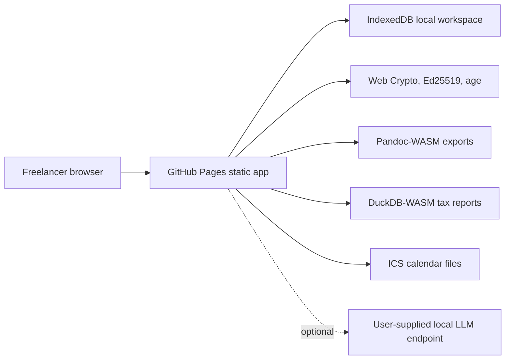

# Solo Practice Flow

https://baditaflorin.github.io/solo-practice-flow/

Local-first freelance CRM for leads, proposals, contracts, invoices, payment-status review, and tax-ready exports.

Solo Practice Flow is a static GitHub Pages app that replaces the early solo-consulting tool chain:
lead capture, proposal generation, contract drafting and signing, invoices, payment-status tracking, and export.

Current release: 0.3.0.

The app displays its build version and build-time commit in the GitHub Pages UI. It also links to the public repository and PayPal support page so visitors can star or support the project from the live page.


## Links

Live app: https://baditaflorin.github.io/solo-practice-flow/

Repository: https://github.com/baditaflorin/solo-practice-flow

Support: https://www.paypal.com/paypalme/florinbadita

## Verified Features

- Load real intake through typing, paste, file picker, drag/drop, multi-file text batch, clipboard read, sample intake, or a small `#intake=` share URL.
- Infer lead, proposal, invoice, payment-export, contract, transcript, and adversarial-input signals with confidence, evidence, anomalies, and suggested fixes.
- Capture leads, generate proposals, draft contracts, sign and verify contracts with Ed25519, create proposal-based invoices, and track invoice paid amount/status.
- Export Markdown, Pandoc HTML, ICS reminders, tax CSV, DuckDB CSV with fallback, JSON backup, and age-encrypted backup.
- Copy current document, tax CSV, and automation JSON; print the current document; restore JSON or age-encrypted backups.
- Persist workspace state locally with IndexedDB/Yjs and reset intentionally with Start fresh.

## Quickstart

```bash
npm install
make install-hooks
make dev
make test
make build
```

## Local Checks

```bash
make lint
make test
make smoke
npm run test:coverage
npm audit --audit-level=high
```

Hooks are plain shell scripts in `.githooks/` and are wired with `make install-hooks`.

## Architecture

Mode A: Pure GitHub Pages. The frontend runs entirely in the browser, persists records to
IndexedDB/Yjs local structures, and lazy-loads heavy document/data capabilities only when needed.



## Backup And Automation JSON

`JSON backup` and `Copy JSON` produce a provenance envelope:

```json
{
  "provenance": {
    "app_version": "0.3.0",
    "commit": "build-time commit",
    "schema_version": 1,
    "generated_at": "ISO timestamp",
    "source_id": "workspace-backup",
    "parameters": {}
  },
  "state": {
    "schemaVersion": 1,
    "profile": {},
    "settings": {},
    "leads": [],
    "proposals": [],
    "contracts": [],
    "invoices": []
  }
}
```

Restore accepts this envelope and legacy raw `PracticeState` JSON. Encrypted `.age` restore first decrypts with the passphrase field, then validates the same JSON contract.

## Limitations

- No hosted sync, team accounts, backend API, webhooks, or server-side secrets.
- No arbitrary URL scraping from GitHub Pages because browser CORS blocks many client sites; paste rendered text or load saved HTML instead.
- No OCR/image intake or folder import.
- Payment support is invoice paid amount/status plus payment-export inference, not bank/PayPal reconciliation or a payment ledger.
- Pandoc HTML and DuckDB CSV use lazy browser modules. Markdown and plain Tax CSV remain the fallback exports.
- The visible commit is the commit used at build time, not a live GitHub API lookup.

## Documentation

Architecture: docs/architecture.md

Deployment: docs/deploy.md

ADRs: docs/adr/

Phase 2 substance audit: docs/phase2-substance/realdata-audit.md

Phase 2 postmortem: docs/postmortem-phase2-substance.md

Phase 3 completeness audit: docs/phase3/findings.md

Phase 3 postmortem: docs/postmortem-phase3.md
