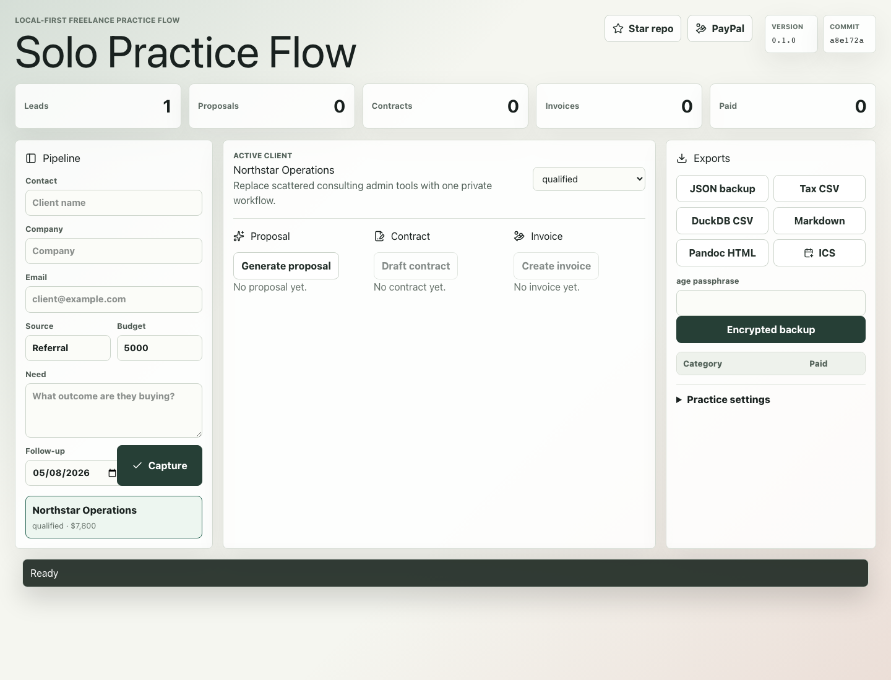
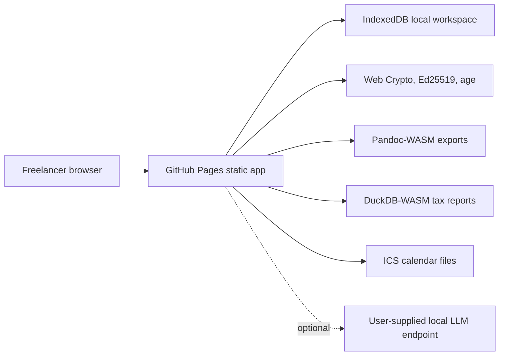

# Solo Practice Flow

https://baditaflorin.github.io/solo-practice-flow/

Local-first freelance CRM for leads, proposals, contracts, invoices, payments, and tax-ready exports.

Solo Practice Flow is a static GitHub Pages app that replaces the early solo-consulting tool chain:
lead capture, proposal generation, contract drafting and signing, invoices, payment tracking, and export.



## Links

Live app: https://baditaflorin.github.io/solo-practice-flow/

Repository: https://github.com/baditaflorin/solo-practice-flow

Support: https://www.paypal.com/paypalme/florinbadita

## Quickstart

```bash
npm install
make install-hooks
make dev
make test
make build
```

## Local Checks

```bash
make lint
make test
make smoke
npm run test:coverage
npm audit --audit-level=high
```

Hooks are plain shell scripts in `.githooks/` and are wired with `make install-hooks`.

## Architecture

Mode A: Pure GitHub Pages. The frontend runs entirely in the browser, persists records to
IndexedDB/OPFS-friendly structures, and lazy-loads heavy document/data capabilities only when needed.



## Documentation

Architecture: docs/architecture.md

Deployment: docs/deploy.md

ADRs: docs/adr/
