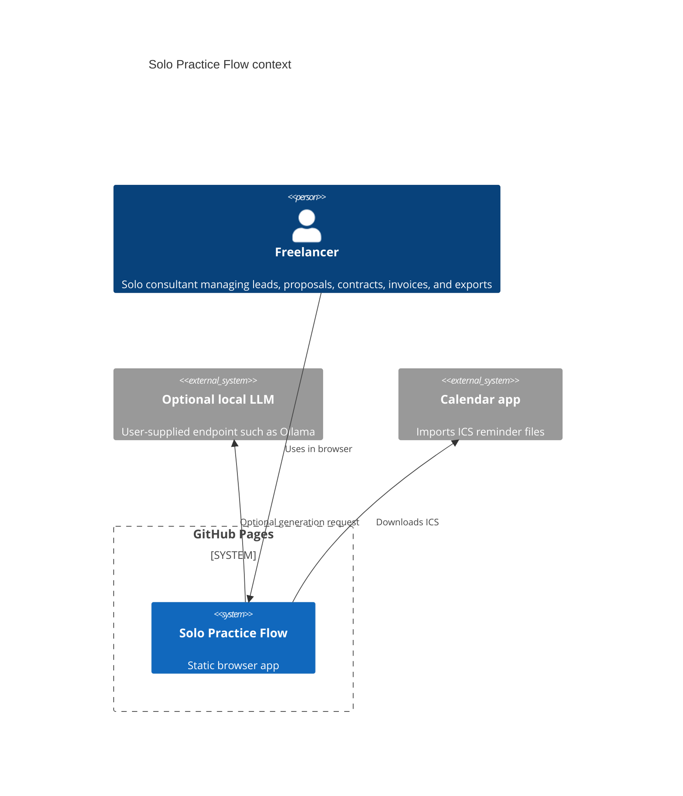
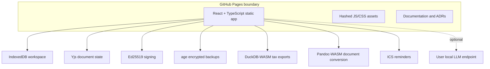

# Architecture

Live app: https://baditaflorin.github.io/solo-practice-flow/

Repository: https://github.com/baditaflorin/solo-practice-flow

## Context

```mermaid
C4Context
  title Solo Practice Flow context
  Person(freelancer, "Freelancer", "Solo consultant managing leads, proposals, contracts, invoices, and exports")
  System_Boundary(pages, "GitHub Pages") {
    System(app, "Solo Practice Flow", "Static browser app")
  }
  System_Ext(localLlm, "Optional local LLM", "User-supplied endpoint such as Ollama")
  System_Ext(calendar, "Calendar app", "Imports ICS reminder files")
  Rel(freelancer, app, "Uses in browser")
  Rel(app, localLlm, "Optional generation request")
  Rel(app, calendar, "Downloads ICS")
```

## Container

```mermaid
flowchart TB
  subgraph "GitHub Pages boundary"
    App["React + TypeScript static app"]
    Assets["Hashed JS/CSS assets"]
    Docs["Documentation and ADRs"]
  end
  App --> Store["IndexedDB workspace"]
  App --> Yjs["Yjs document state"]
  App --> Sign["Ed25519 signing"]
  App --> Age["age encrypted backups"]
  App --> Duck["DuckDB-WASM tax exports"]
  App --> Pandoc["Pandoc-WASM document conversion"]
  App --> Ics["ICS reminders"]
  App -. optional .-> Ollama["User local LLM endpoint"]
```
